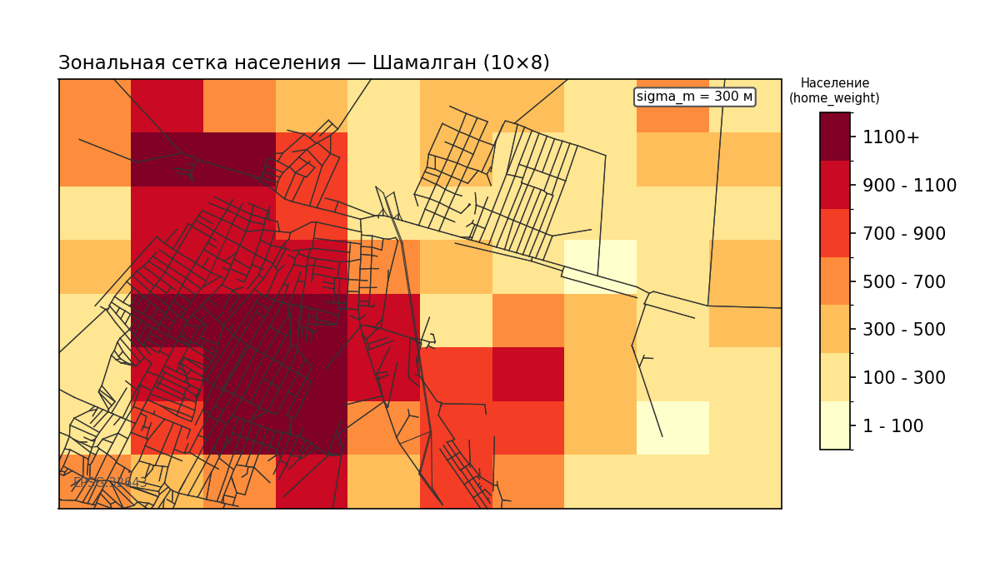
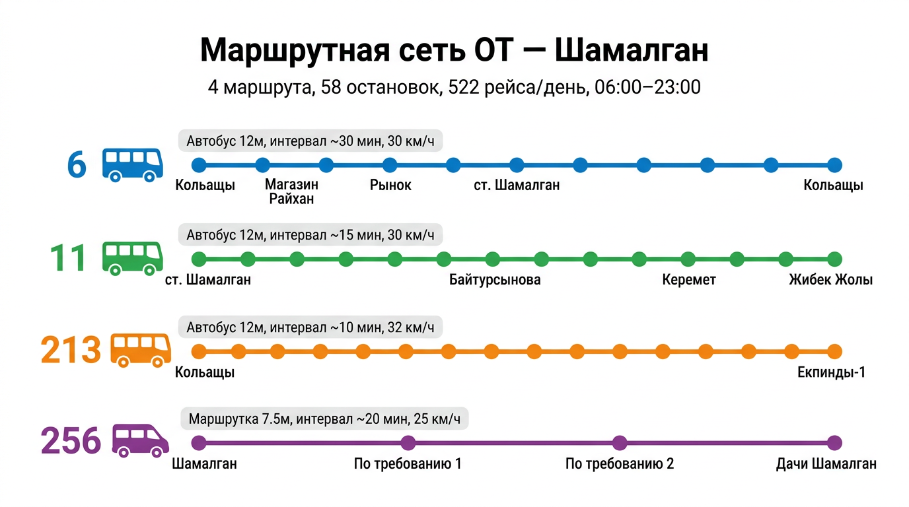
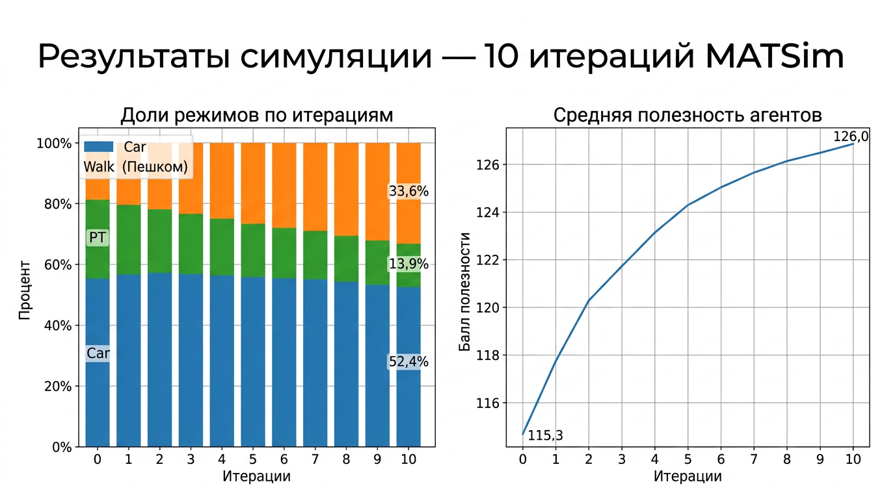

# Транспортная модель сценария «Шамалган»: итоговый отчёт

---

## 1. Введение

Настоящий отчёт подводит итоги работы над сценарием «Шамалган» — пробной (proof-of-concept) транспортной моделью на базе фреймворка MATSim. Территория сценария — село Шамалган и ближние окрестности (Алматинская область, Казахстан).

Цель проекта — отработать полный цикл: от подготовки исходных данных до запуска агентной симуляции с общественным транспортом, с корректровками УДС, выбором режимов и визуализацией результатов.

---

## 2. Что было сделано (хронология работ)

### 2.1. Подготовка геоданных (GeoPackage)

Исходные пространственные данные территории собраны в файл **`new_map.gpkg`** формата **GeoPackage** (OGC-стандарт на базе SQLite).

**Слои GeoPackage:**

| Слой | Тип геометрии | Содержание |
|------|---------------|------------|
| `map__lines` | Линии | Осевые линии улично-дорожной сети |
| `map__multilinestrings` | Линии | Двойные линии единственной магистрали в селе |
| `New_Points` | Точки | Коммерческие объекты (магазины, заправки), а также остановки ОТ с атрибутами маршрутов |
| `map__multipolygons` | Полигоны | Границы застройки и территории (на данном этапе **не используются**) |

Из слоя точек были вычленены коммерческие объекты (магазины, заправки), которые позже учтены при расчёте рабочих мест по зонам. Также в этом слое вручную размечены остановки ОТ — через панель атрибутов QGIS, поле `route direction`. Для каждой остановки указаны номера маршрутов и порядковый номер остановки в маршруте (например, `"6"=>"7", "11"=>"15"` означает: на маршруте 6 это 7-я остановка, на маршруте 11 — 15-я).

> **Примечание.** Разметка маршрутов через атрибуты точек — вынужденный приём, позволивший быстро описать маршрутную сеть без GTFS. В следующем проекте планируется использовать штатные инструменты (GTFS, pt2matsim, neatnet).

### 2.2. Построение улично-дорожной сети (УДС)

**Источник геометрии:** файл OSM, хранящийся в `original-input-data/shamalgan/map`.

**Построение:** класс `PrepareShamalganNetwork` считывает OSM, трансформирует координаты в EPSG:32643 (UTM 43N) и применяет стандартный набор правил MATSim OsmNetworkReader: тип дороги → полосность, свободная скорость и пропускная способность на полосу.

**Полосность.** Подавляющее большинство линков имеют **1 полосу на направление** (то есть двухполосная дорога: прямая + обратная). Единственная магистраль — **2 полосы на направление** (четырёхполосная). Полосность назначается из тегов OSM (`lanes`, `lanes:forward`, `lanes:backward`), при их отсутствии — по классу дороги: `motorway`/`trunk` → 2, остальные → 1. Вручную полосность практически не корректировалась.

**Профиль дорог.** На основе исследования панорамных снимков из Яндекса установлено, что дороги в селе имеют преимущественно плохое покрытие. Поэтому применён профиль `poor`, который:

| Класс скорости | Исходная скорость (м/с) | Целевая скорость (км/ч) | Множитель пропускной способности |
|----------------|-------------------------|-------------------------|----------------------------------|
| Highway (≥ 20 м/с) | 72+ км/ч | 70 | ×0,85 |
| Arterial (12–20 м/с) | 43–72 км/ч | 45 | ×0,80 |
| Collector (8–12 м/с) | 29–43 км/ч | 30 | ×0,75 |
| Local (<8 м/с) | <29 км/ч | 20 | ×0,70 |

Итого дворовые и местные дороги получили целевую скорость ~20 км/ч, магистраль — ~70 км/ч. Пропускная способность снижена на 15–30% с нижней границей 150 авт/ч.

> **Примечание.** Профиль дорог poor был установлен на предположении и является скорее тестом функционала фреймворка, чем верифицированным свойством.

**Итоговые параметры сети:** 1 128 узлов, 2 991 линк, одна связная компонента, ноль тупиков и изолированных узлов.

**Замечание о геометрии.** При визуальном сравнении геометрия линков из OSM-шейпа заметно упрощена функцией перевода шейпа в MATSim формат по сравнению с реальной трассировкой улиц: дуги спрямлены, повороты сглажены. Для proof-of-concept это не критично, однако для повышения точности геометрию целесообразно уточнить в следующей итерации разработки.


### 2.3. Распределение населения по сети

**Задача:** разместить синтетических транспортных агентов на линках дорожной сети.

**Исходные данные.** Использована карта плотности населения Шаламалгана. На её основе скрипт `derive_shamalgan_zones.py` делит территорию на **прямоугольную сетку 10×8** (80 ячеек). Каждая ячейка — транспортный район (зона) размером порядка **300 м по каждой грани** (зависит от протяжённости территории). Из 80 ячеек активны только те, где плотность населения > 0 (пустые отбрасываются).

Для каждой зоны вычислены:
- **home_weight** — суммарное число жителей (вес «дом»);
- **work_weight** — число рабочих мест (вес «работа»); для зон, в которых расположены коммерческие объекты из GeoPackage, вес увеличен;
- **sigma_m** — радиус рассеяния агентов внутри зоны (по умолчанию 300 м).

**Алгоритм размещения агента на сети:**

1. Случайно выбирается **зона дома** (с вероятностью, пропорциональной `home_weight`) и **зона работы/другой активности** (по `work_weight`).
2. Внутри зоны агент размещается **с вероятностью, пропорциональной длине линка**: среди всех линков, попадающих в круг радиуса `sigma_m` вокруг центра зоны, выбирается линк с вероятностью ~длина/сумма длин. Затем координата агента — случайная точка на этом линке. Это предотвращает сгущение агентов на коротких тупиковых линках.
3. **Запасной механизм:** если в радиусе `sigma_m` нет ни одного линка, координата определяется гауссовым разбросом (`sigma_m` — стандартное отклонение) вокруг центра зоны, после чего агент привязывается к ближайшему линку сети (`NetworkUtils.getNearestLinkExactly`).

**Параметры генерации:**

| Параметр | Значение |
|----------|----------|
| Число агентов | ~30 481 (по сумме `home_weight`, ограничение 500–100 000) |
| Доля занятых | 65% |
| Начальное распределение режимов | автомобиль 55%, ОТ 25%, пешком 20% |
| План занятого | дом → работа → дом |
| План незанятого | дом → другое → дом |
| Выезд на работу | 07:00–08:59 (случайно) |
| Возврат с работы | 16:00–18:59 |
| Выезд «другое» | 10:00–14:59 |
| Возврат «другое» | 12:00–19:59 |

> Начальные доли режимов — только стартовые значения. MATSim в процессе итераций перераспределяет агентов между режимами (car, pt, walk) через модуль SubtourModeChoice.



### 2.4. Построение сети общественного транспорта

**Маршруты.** Из GeoPackage извлечены 4 маршрута: **6, 11, 213 и 256** (всего 8 направлений — прямое и обратное). Маршруты и последовательность остановок определены по данным **Яндекс.Карт** и **2ГИС**.

**Трасса маршрутов.** Между каждой парой соседних остановок трасса строится алгоритмом Дейкстры по дорожной сети. Однако простейший кратчайший путь не всегда совпадает с реальным ходом маршрута, поэтому введены корректировки:

- **Маршрут 213:** задан обязательный коридор (ключевой линк 2011) — маршрут должен пройти через этот линк. Одновременно заблокированы линки у железнодорожного переезда, через которые реальный автобус не проходит.
- **Маршрут 256:** допустимы только линки с определёнными `origid` — маршрутка ходит по узкому коридору, а не по магистрали.

**Привязка остановок.** Каждая остановка «прикреплена» к ближайшему линку сети (snap). Максимальное расстояние snap — 20,6 м; остановок с расстоянием > 80 м — ноль. Недостижимых сегментов — ноль.

**Расписание.** Задано по периодам дня (06:00–23:00) с переменными интервалами. Целевые средние интервалы калиброваны по данным Яндекса:

| Маршрут | Тип ТС | Вместимость | Целевой интервал | Скорость |
|---------|--------|-------------|------------------|----------|
| 6 | Автобус (12 м) | 35 + 30 стоячих | ~30 мин | 30 км/ч |
| 11 | Автобус (12 м) | 35 + 30 стоячих | ~15 мин | 30 км/ч |
| 213 | Автобус (12 м) | 35 + 30 стоячих | ~10 мин | 32 км/ч |
| 256 | Маршрутка (7,5 м) | 18 + 8 стоячих | ~20 мин | 25 км/ч |

Время стоянки на каждой остановке — 60 с (консервативная оценка). Обгон на конечных — 5 мин (маршруты 6, 11) и 7 мин (213, 256).

Всего: **58 остановок**, **522 рейса в сутки**, **4 типа транспортных средств**.



*Схематическая карта маршрутов ОТ (без наложения линий):*


### 2.5. Отладка и запуск симуляции

Сценарий отлажен и успешно запускается через `RunShamalgan` с конфигурацией `config.xml`.

**Ключевые настройки:**
- `qsim.endTime = 30:00:00` (до 06:00 следующего дня) — необходимо для корректного завершения при включённом ОТ.
- `transit.useTransit = true`, маршрутизация — SwissRailRaptor.
- `SubtourModeChoice` с режимами `car, pt, walk`.
- 11 итераций (0–10).

**Результаты прогона (итерация 10):**

| Показатель | Значение |
|------------|----------|
| Доля поездок на автомобиле | 52,4% |
| Доля поездок на ОТ | 13,9% |
| Доля пеших поездок | 33,6% |
| Средняя полезность (avg_executed) | 126,0 (рост с 115,3 на ит. 0) |

Рост средней полезности по итерациям указывает на сходимость модели. Доля ОТ снизилась по сравнению с начальными 25%: модель «перенаправила» часть агентов на пешие поездки, что характерно для малой территории с плотной застройкой и относительно короткими расстояниями.



---

## 3. Архитектура данных и инструментов

```
original-input-data/shamalgan/
├── new_map.gpkg             ← GeoPackage: линки, точки (остановки, POI), полигоны
├── map                      ← OSM-файл территории
└── zones-derived.csv        ← Зональная сетка (10×8): веса населения и рабочих мест

tools/
├── derive_shamalgan_zones.py            ← Нарезка зон по растру плотности
├── extract_tagged_routes_from_gpkg.py   ← Извлечение остановок ОТ из GeoPackage
├── build_pt_map_html.py                 ← Интерактивная карта маршрутов ОТ
└── build_population_on_network_infographic.py ← Карта населения на сети

src/main/java/org/matsim/project/
├── PrepareShamalganNetwork.java                  ← Сеть из OSM + профиль дорог
├── PrepareShamalganPopulationFromZones.java       ← Население по зонам
├── PrepareShamalganTransitFromAssumptions.java    ← ОТ: расписание, маршруты, парк
└── RunShamalgan.java                              ← Запуск симуляции

scenarios/shamalgan/
├── config.xml               ← Конфигурация MATSim
├── network.xml              ← Базовая дорожная сеть
├── network-with-pt.xml      ← Сеть + псевдолинки ОТ
├── transitSchedule.xml      ← Расписание ОТ
├── transitVehicles.xml      ← Подвижной состав ОТ
├── population.xml           ← Синтетическое население
└── pt_service_profile.csv   ← Профиль обслуживания по маршрутам и периодам
```

---

## 4. Аудит реалистичности

### 4.1. УДС: пропускная способность и полосность

Пропускная способность задаётся дефолтами MATSim OsmNetworkReader и корректируется профилем `poor`:

| Тип дороги | Полос (на направление) | Пропускная способность на полосу (авт/ч) | Норматив (HCM / МГСН) |
|------------|------------------------|------------------------------------------|------------------------|
| Магистраль | 2 | 1 500–2 000 | 1 200–2 300 (непрерывный поток) |
| Городская магистраль | 1 | 1 000–1 500 | 750–1 550 (перекрёстки в одном уровне — разных уровнях) |
| Местная / жилая | 1 | 300–600 | 600–850 |

Подробный аудит: [08_uds_capacity_lanes_audit.md](08_uds_capacity_lanes_audit.md).

### 4.2. ОТ: параметры подвижного состава и расписания

| Параметр | Значение в модели | Сравнение с практикой |
|----------|-------------------|-----------------------|
| Вместимость автобуса | 65 чел. (35+30) | Норма для 12-метрового автобуса |
| Вместимость маршрутки | 26 чел. (18+8) | Типично для класса «Газель» |
| Скорость ОТ | 25–32 км/ч | Средняя скорость автобусов в городах — 20–26 км/ч; для пригорода 25–32 допустимо |
| Время стоянки | 60 с | Практика: 30–60 с; 60 с — консервативно |
| Интервалы | 10–30 мин (по маршруту и периоду) | Типично для пригородных маршрутов |

Подробный аудит: [09_pt_network_attributes_audit.md](09_pt_network_attributes_audit.md).

---

## 5. Известные ограничения и что предстоит доработать

| Ограничение | Влияние | Приоритет |
|-------------|---------|-----------|
| Упрощённая геометрия линков (спрямление дуг) | Неточные длины перегонов | Средний |
| ОТ — bootstrap (без GTFS) | Расписание по допущениям, а не по факту | Средний |
| Нет калибровки по наблюдениям | Доли режимов не верифицированы | Высокий (при переходе к реальному сценарию) |
| Нет facilities (объектов притяжения) | Упрощённый спрос: дом→работа/другое→дом | Низкий (для proof-of-concept) |
| Синтетическое население без демографии | Нет возрастной структуры, наличия авто, дохода | Низкий (для proof-of-concept) |

---

## 6. Выводы

1. **Полный цикл пройден:** от подготовки геоданных до запуска многоитерационной симуляции с ОТ, выбором режимов и визуализацией.
2. **Сценарий работоспособен:** 10+ итераций без ошибок, наблюдается сходимость полезности и перераспределение режимов.
3. **Атрибуты сети и ОТ в рамках нормативов:** проверены по HCM, МГСН и открытым данным Яндекс/2ГИС.
4. **Ключевой урок:** при наличии минимальных исходных данных (OSM, растр плотности, Яндекс-маршруты) можно за короткий срок собрать работающий сценарий MATSim. Для перехода к production-уровню необходимы GTFS, данные обследований и цикл калибровки.

---

## 7. Визуализации

### Перечень существующих визуализаций

| Файл | Содержание |
|------|------------|
| `Visualization/pt_routes_map.html` | Интерактивная карта маршрутов ОТ (Leaflet) |
| `Visualization/pt_routes_map.svg` | Маршруты ОТ на фоне дорожной сети (SVG) |
| `Visualization/population_on_network_map.html` | Карта распределения населения по линкам |

### Необходимые визуализации (для презентации и Notion)

| № | Визуализация | Статус | Промпт для визуализатора |
|---|-------------|--------|--------------------------|
| 1 | Карта УДС с цветовой кодировкой по скорости/полосности | Нужна | Построить карту network.xml: линки окрашены по freespeed (шкала), толщина — по числу полос |
| 2 | Карта зон (10×8) с весами населения и рабочих мест | Нужна | Построить тепловую карту зон из zones-derived.csv: цвет — home_weight, подписи — zone_id |
| 3 | Карта распределения агентов по линкам (обновлённая PNG) | Нужна | Перестроить infographic из population_by_link.csv на фоне network.xml |
| 4 | Карта маршрутов ОТ с остановками (обновлённая PNG) | Нужна | Рендер из pt_routes_map.html или SVG в PNG с подписями маршрутов |
| 5 | График сходимости: средняя полезность и доли режимов по итерациям | Нужна | Из output/scorestats.csv и modestats.csv: два графика |
| 6 | Скриншот упрощённой геометрии vs реальной (для раздела ограничений) | Нужна | Сравнить участок сети из OSM и из панорамы Яндекса |

---

## 8. План презентации (PDF / Notion)

**Структура:**

1. **Титульный слайд.** Название проекта, территория, дата.
2. **Постановка задачи.** Что моделируем, зачем, чем MATSim.
3. **Исходные данные.** GeoPackage (слои), OSM, растр плотности → зоны. *Визуализация: карта зон (#2).*
4. **Дорожная сеть.** Построение из OSM, профиль `poor`, параметры. *Визуализация: карта УДС (#1).*
5. **Население.** Алгоритм, взвешенное размещение, параметры. *Визуализация: карта населения (#3).*
6. **Общественный транспорт.** Маршруты из Яндекса/2ГИС, расписание, подвижной состав. *Визуализация: карта ОТ (#4).*
7. **Запуск и результаты.** 10 итераций, доли режимов, сходимость. *Визуализация: графики (#5).*
8. **Аудит реалистичности.** Сравнение с HCM, МГСН, Яндекс. Таблицы из аудитов.
9. **Ограничения и следующие шаги.** Геометрия, GTFS, калибровка. *Визуализация: скриншот геометрии (#6).*
10. **Выводы.**

---

## Связанные документы

- [07_uds_pt_population_analysis.md](07_uds_pt_population_analysis.md) — анализ УДС, ОТ и населения
- [08_uds_capacity_lanes_audit.md](08_uds_capacity_lanes_audit.md) — аудит пропускной способности и полосности
- [09_pt_network_attributes_audit.md](09_pt_network_attributes_audit.md) — аудит параметров ОТ
- [scenarios/shamalgan/POPULATION_ALGORITHM.md](../../scenarios/shamalgan/POPULATION_ALGORITHM.md) — алгоритм населения
- [scenarios/shamalgan/PT_BOOTSTRAP_SETTINGS.md](../../scenarios/shamalgan/PT_BOOTSTRAP_SETTINGS.md) — настройки ОТ
- [analysis-artifacts/pt-data/OT_SYSTEM_REPORT.md](../../analysis-artifacts/pt-data/OT_SYSTEM_REPORT.md) — отчёт по системе ОТ
