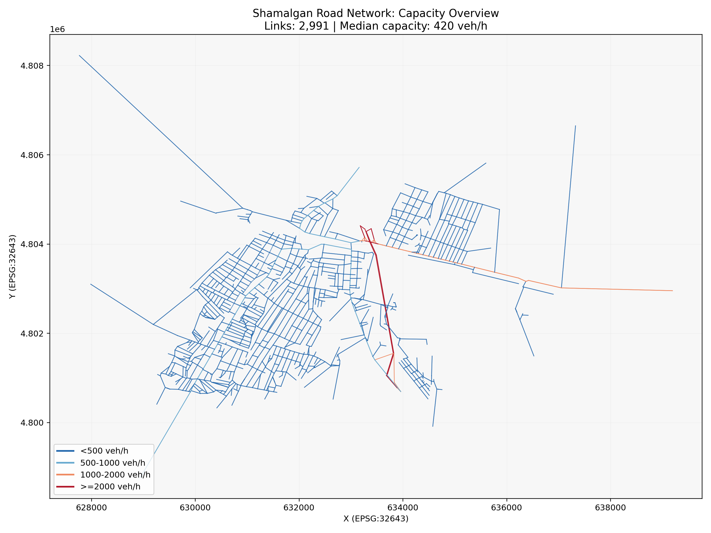
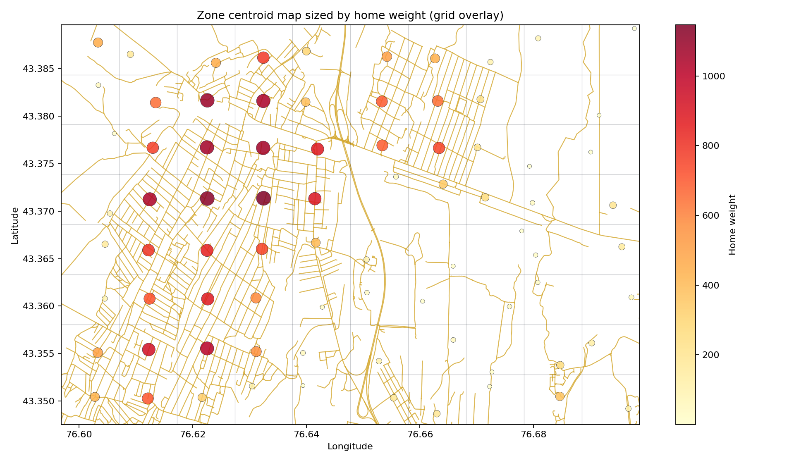
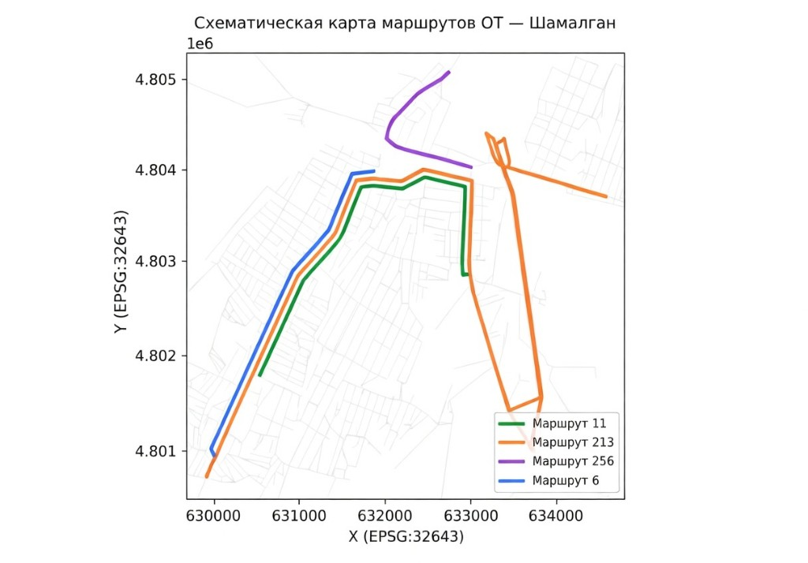
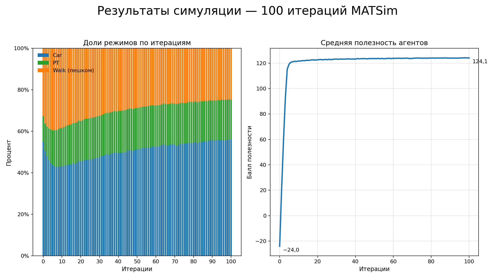
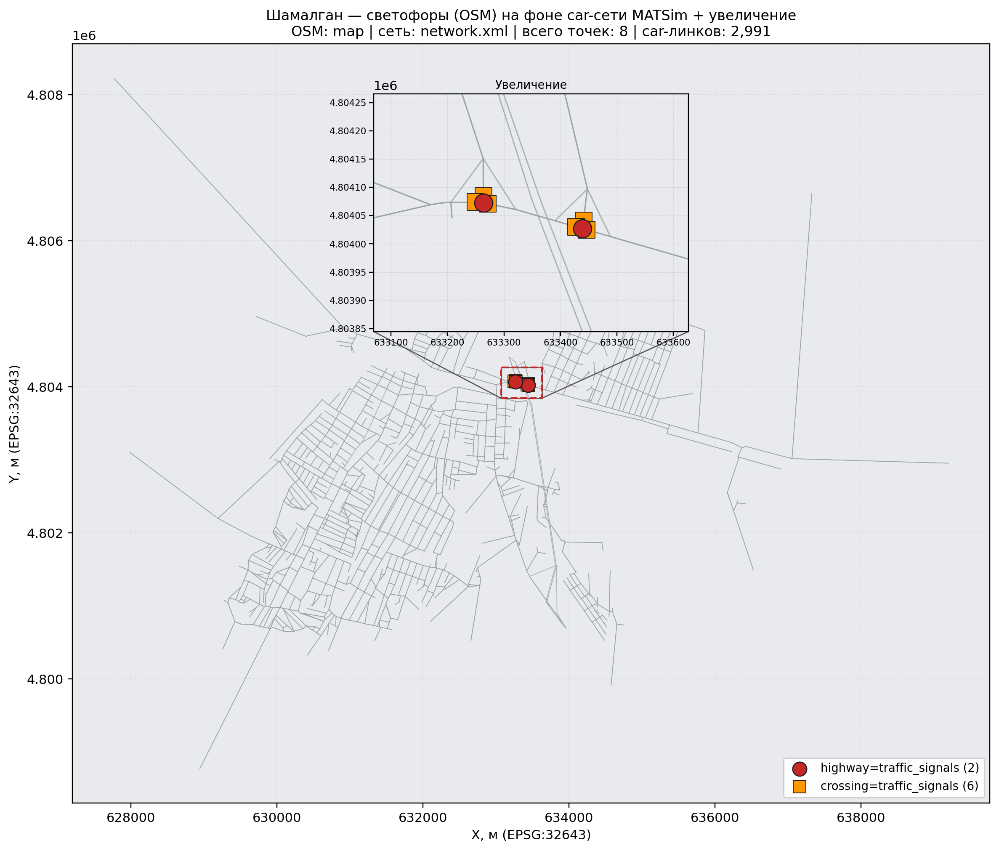

# Транспортная модель сценария «Шамалган»: отчет о проделанной работе
17.02.2026 - 19.03.2026
---

## 1. Введение

Настоящий отчёт подводит итоги работы над сценарием «Шамалган» - пробной (proof-of-concept) транспортной моделью на базе фреймворка MATSim. Территория сценария - село Шамалган и ближние окрестности (Алматинская область, Казахстан). Для упрощения сценария было принято решение не моделировать внешний (кордонный) спрос за пределами моделируемой области, транспортная модель рассматривается как закрытая система без кордонов.

Цель проекта - отработать полный цикл: от подготовки исходных данных до запуска агентной симуляции с общественным транспортом, с корректровками УДС, выбором режимов и визуализацией результатов.

---

## 2. Что было сделано (хронология работ)

### 2.1. Подготовка геоданных (GeoPackage)

Исходные пространственные данные территории собраны в файл **`new_map.gpkg`** формата **GeoPackage**.

**Слои GeoPackage:**

| Слой | Тип геометрии | Содержание |
|------|---------------|------------|
| `map__lines` | Линии | Осевые линии улично-дорожной сети |
| `map__multilinestrings` | Линии | Двойные линии единственной магистрали в селе |
| `New_Points` | Точки | Коммерческие объекты (магазины, заправки), а также остановки ОТ с атрибутами маршрутов |
| `map__multipolygons` | Полигоны | Границы застройки и территории (на данном этапе **не используются**) |

Из слоя точек были вычленены коммерческие объекты (магазины, заправки), которые позже учтены при расчёте рабочих мест по зонам. Также в этом слое вручную размечены остановки ОТ - через панель атрибутов QGIS, поле `route direction`. Для каждой остановки указаны номера маршрутов и порядковый номер остановки в маршруте (например, `"6"=>"7", "11"=>"15"` означает: на маршруте 6 это 7-я остановка, на маршруте 11 - 15-я).

> **Примечание.** Разметка маршрутов через атрибуты точек - вынужденный приём, позволивший быстро описать маршрутную сеть без GTFS. В следующем проекте планируется использовать штатные инструменты (GTFS, pt2matsim, neatnet).

### 2.2. Построение улично-дорожной сети (УДС)

**Источник геометрии:** файл OSM, хранящийся в `original-input-data/shamalgan/map`.

**Построение:** класс `PrepareShamalganNetwork` считывает OSM, трансформирует координаты в EPSG:32643 (UTM 43N) и применяет стандартный набор правил MATSim OsmNetworkReader: тип дороги → полосность, свободная скорость и пропускная способность на полосу.

**Полосность.** Подавляющее большинство линков имеют **1 полосу на направление** (то есть двухполосная дорога: прямая + обратная). Единственная магистраль - **2 полосы на направление** (четырёхполосная). Полосность назначается из тегов OSM (`lanes`, `lanes:forward`, `lanes:backward`), при их отсутствии - по классу дороги: `motorway`/`trunk` → 2, остальные → 1. Вручную полосность практически не корректировалась.

**Профиль дорог.** На основе исследования панорамных снимков из Яндекса установлено, что дороги в селе имеют преимущественно плохое покрытие. Поэтому применён профиль `poor`, который:

| Класс скорости | Исходная скорость (м/с) | Целевая скорость (км/ч) | Множитель пропускной способности |
|----------------|-------------------------|-------------------------|----------------------------------|
| Highway (≥ 20 м/с) | 72+ км/ч | 70 | ×0,85 |
| Arterial (12-20 м/с) | 43-72 км/ч | 45 | ×0,80 |
| Collector (8-12 м/с) | 29-43 км/ч | 30 | ×0,75 |
| Local (<8 м/с) | <29 км/ч | 20 | ×0,70 |

Итого дворовые и местные дороги получили целевую скорость ~20 км/ч, магистраль - ~70 км/ч. Пропускная способность снижена на 15-30% с нижней границей 150 авт/ч.

> **Примечание.** Профиль дорог poor был установлен на предположении и является скорее тестом функционала фреймворка, чем верифицированным свойством.

**Итоговые параметры сети:** 1 128 узлов, 2 991 линк, одна связная компонента, ноль тупиков и изолированных узлов.

**Замечание о геометрии.** При визуальном сравнении геометрия линков из OSM-шейпа заметно упрощена функцией перевода шейпа в MATSim формат по сравнению с реальной трассировкой улиц: дуги спрямлены, повороты сглажены. Для proof-of-concept это не критично, однако для повышения точности геометрию целесообразно уточнить в следующей итерации разработки.

Ниже - карты контроля качества сети: распределение свободной скорости и пропускной способности по линкам (генерируются скриптами `plot_network_speed_overview.py` и `plot_network_capacity_overview.py`).


*Рис. - свободная скорость по линкам (км/ч).*

> **Свободная скорость** - это максимальная скорость движения по участку дороги (линку) в условиях отсутствия помех (пробок, светофоров и пр.), отражает качество дорожного покрытия и допустимую скорость согласно правилам и характеристикам дороги. В модели MATSim свободная скорость задаётся для каждого линка и определяет, с какой скоростью могут передвигаться транспортные агенты при отсутствии других ограничений.



*Рис. - пропускная способность по линкам (авт/ч).*

### 2.3. Распределение населения по сети

**Задача:** разместить синтетических транспортных агентов на линках дорожной сети.

**Исходные данные.** Использована карта плотности населения Шамалгана. Источник: data.humdata.org На её основе скрипт `derive_shamalgan_zones.py` делит территорию по границам OSM на **прямоугольную сетку 10×8** (80 ячеек) **в координатах долгота/широта**. Каждая ячейка - транспортный район (зона) в форме **прямоугольника**; в метрах (для текущего OSM-экстента Шамалгана) размер ячейки составляет примерно **800 м по горизонтали (В-З) и 600 м по вертикали (С-Ю)**, площадь - порядка **0,5 км²**. Из 80 ячеек активны только те, где плотность населения > 0 (пустые отбрасываются).

Для каждой зоны вычислены:
- **home_weight** - суммарное число жителей (вес «дом»);
- **work_weight** - число рабочих мест (вес «работа»); для зон, в которых расположены коммерческие объекты из GeoPackage, вес увеличен;

**Алгоритм размещения агента на сети:**

*`home_weight` и `work_weight` - количественные веса (число жителей / рабочих мест в зоне); вероятность выбора зоны = вес зоны / сумма весов по всем зонам.*

1. Случайно выбирается **зона дома** (с вероятностью, пропорциональной `home_weight`) и **зона работы/другой активности** (по `work_weight`).
2. Внутри зоны агент размещается **с вероятностью, пропорциональной длине линка**: среди всех линков в фиксированном радиусе **300 м** вокруг центроида зоны выбирается линк с вероятностью ~длина/сумма длин. Затем координата агента - случайная точка на этом линке. Это предотвращает сгущение агентов на коротких тупиковых линках.
3. **Однако:** если в радиусе **300 м** нет ни одного линка, координата определяется случайным разбросом вокруг центроида зоны, после чего агент привязывается к ближайшему линку сети (`NetworkUtils.getNearestLinkExactly`).

**Параметры генерации:**

| Параметр | Значение |
|----------|----------|
| Число агентов | ~30 481 (по сумме `home_weight`) |
| Доля занятых | 65% |
| Режим при генерации планов (`PrepareShamalganPopulationFromZones`, главные поездки) | автомобиль 55%, ОТ 25%, пешком 20% |
| Доли по **исполненным ногам**, итерация 0 (`output_100it/modestats.csv`) | автомобиль 54,8%, ОТ 12,5%, пешком 32,7% |
| План занятого | дом → работа → дом |
| План незанятого | дом → другое → дом |
| Выезд на работу | 07:00-08:59 |
| Возврат с работы | 16:00-18:59 |
| Выезд «другое» | 10:00-14:59 |
| Возврат «другое» | 12:00-19:59 |

> Доли 55/25/20 задают **выбор режима для главной поездки** при сборке `population.xml`; в `modestats` учитываются **все ноги** симулируемого дня (в том числе пешком до/от остановки и пересадки), поэтому на ит. 0 доля ног «pt» ниже, а «walk» выше, чем 25% и 20%. Далее MATSim перераспределяет режимы через SubtourModeChoice.



*Рис. - центроиды зон (10×8): размер и цвет кружков = home_weight, фон - OSM-дороги, WGS84. Генерируется скриптом `derive_shamalgan_zones.py`.*

### 2.4. Построение сети общественного транспорта

**Маршруты.** Без GTFS данных было принято решение отрисовать маршруты самостоятельно на основе данных из **citybus.kz**, **Яндекс.Карт** и **2ГИС**. Извлечены 4 маршрута: **6, 11, 213 и 256** (всего 8 направлений - прямое и обратное). Сценарий собран как закрытая система, поэтому пути маршрутов за границами моделируемой области были размечены как конечные остановки.

**Трасса маршрутов.** Между каждой парой соседних остановок трасса строится алгоритмом Дейкстры по дорожной сети. Однако простейший кратчайший путь не всегда совпадает с реальным ходом маршрута, поэтому введены корректировки

- **Маршрут 213:** задан обязательный коридор (ключевой линк 2011) - маршрут должен пройти через этот линк. Одновременно заблокированы линки у железнодорожного переезда, через которые реальный автобус не проходит.
- **Маршрут 256:** допустимы только линки с определёнными `origid`, находящиеся по ходу маршрута

**Привязка остановок.** Каждая остановка «прикреплена» к ближайшему линку сети (snap). Максимальное расстояние snap - 20,6 м; остановок с расстоянием > 80 м - ноль. Недостижимых сегментов - ноль.

**Расписание.** Задано по периодам дня (06:00-23:00) с переменными интервалами. Целевые средние интервалы калиброваны по данным Яндекса:

| Маршрут | Тип ТС | Вместимость | Целевой интервал | Макс. скорость ОТ (ограничение) | Фактическая средняя после расчёта |
|---------|--------|-------------|------------------|----------------------------------|----------------------------------|
| 6 | Автобус (12 м) | 35 + 30 стоячих | ~30 мин | 50 км/ч | **около 23 км/ч** |
| 11 | Автобус (12 м) | 35 + 30 стоячих | ~15 мин | 50 км/ч | **около 23 км/ч** |
| 213 | Автобус (12 м) | 35 + 30 стоячих | ~10 мин | 50 км/ч | **около 26 км/ч** |
| 256 | Маршрутка (7,5 м) | 18 + 8 стоячих | ~20 мин | 50 км/ч | **около 21 км/ч** |

*Пояснение к последнему столбцу:* средняя **коммерческая** скорость на полном круге (длина трассы по сети - сумма сегментов в `analysis-artifacts/pt-data/pt_segment_checks.csv`; время в пути - по скоростям построения расписания из `pt_service_profile.csv`: 30, 30, 32 и 25 км/ч; плюс стоянка 30 с на остановку). В qsim транспорт ОТ следует расписанию на псевдолинках, отдельная выгрузка траекторий ТС из `output_100it` не делалась - показатель совпадает с расчётом по текущему расписанию и геометрии маршрута.

Время стоянки на каждой остановке - 30 с. Обгон на конечных - 5 мин (маршруты 6, 11) и 7 мин (213, 256).

Всего: **58 остановок**, **522 рейса в сутки**, **40 уникальных транспортных средств в парке**, **4 типа транспортных средств**.


*Схематическая карта маршрутов ОТ (без наложения линий):*



### 2.5. Отладка и запуск симуляции

Сценарий отлажен и успешно запускается через `RunShamalgan` с конфигурацией `config.xml`.

**Ключевые настройки:**
- `qsim.endTime = 30:00:00` (до 06:00 следующего дня) - необходимо для корректного завершения при включённом ОТ.
- `transit.useTransit = true`, маршрутизация - SwissRailRaptor.
- `SubtourModeChoice` с режимами `car, pt, walk`.
- 101 итерация (0-100).

**Результаты расчёта (итерация 100)** - по `scenarios/shamalgan/output_100it/modestats.csv` и `scorestats.csv` (последний полный расчёт с учётом прокси-светофоров на сети, см. раздел 4.1):

| Показатель | Значение |
|------------|----------|
| Доля поездок на автомобиле | 56,0% |
| Доля поездок на ОТ | 19,3% |
| Доля пеших поездок | 24,7% |
| Средняя полезность (avg_executed) | 124,1 (на ит. 0: −24,0) |

Рост средней полезности по итерациям и стабилизация долей режимов на заключительных итерациях указывают на сходимость модели. Доля поездок на ОТ выросла с ~12,5% (ит. 0) до 19,3% (ит. 100); доля автомобиля остаётся доминирующей, но ниже, чем в ранних черновых отчётах с другими настройками сценария - это следует интерпретировать в связке с текущей сетью, расписанием ОТ и штрафами режимов в `config.xml`.

> Примечание: **В реальности около половины поездок были бы за кордон в другие поселки/город**



*Рис. - слева: доли поездок по режимам (car / pt / walk) по итерациям 0…100; справа: средняя полезность `avg_executed`. Данные: `output_100it/modestats.csv`, `scorestats.csv` (актуальный расчёт с прокси-светофорами на сети).*

---

## 3. Архитектура данных и инструментов

```
original-input-data/shamalgan/
├── new_map.gpkg             ← GeoPackage: линки, точки (остановки, POI), полигоны
├── map                      ← OSM-файл территории
└── zones-derived.csv        ← Зональная сетка (10×8): веса населения и рабочих мест

tools/
├── derive_shamalgan_zones.py            ← Нарезка зон по растру плотности
├── extract_tagged_routes_from_gpkg.py   ← Извлечение остановок ОТ из GeoPackage
├── build_pt_map_html.py                 ← Интерактивная карта маршрутов ОТ
├── plot_traffic_signals_map.py          ← Карта OSM-светофоров на фоне car-сети
└── build_population_on_network_infographic.py ← Карта населения на сети

src/main/java/org/matsim/project/
├── PrepareShamalganNetwork.java                  ← Сеть из OSM + профиль дорог
├── PrepareShamalganPopulationFromZones.java       ← Население по зонам
├── PrepareShamalganTransitFromAssumptions.java    ← ОТ: расписание, маршруты, парк
└── RunShamalgan.java                              ← Запуск симуляции

scenarios/shamalgan/
├── config.xml               ← Конфигурация MATSim
├── network.xml              ← Базовая дорожная сеть
├── network-with-pt.xml      ← Сеть + псевдолинки ОТ
├── transitSchedule.xml      ← Расписание ОТ
├── transitVehicles.xml      ← Подвижной состав ОТ
├── population.xml           ← Синтетическое население
└── pt_service_profile.csv   ← Профиль обслуживания по маршрутам и периодам
```

---

## 4. Валидация результатов

### 4.1. Улично-дорожная сеть

**Цель аудита - максимизировать точность модели в виду отсутствия калибровочных данных, реальных профилей дорог и GTFS данных по ОТ**

Пропускная способность: класс `PrepareShamalganNetwork.java` определяет **полосность** и **базовую пропускную способность**: на каждом линке `capacity = N_полос × (значение на полосу из таблицы)`

Профиль **`poor`** **дополнительно** масштабирует уже выставленную базу: умножает `capacity` на коэффициент 0,70-0,85 (и снижает `freespeed` по классу скорости).

| Тип дороги | Полосность | Пропускная способность на полосу (авт/ч) | Ориентир (СН РК 3.03-01-2013 «Автомобильные дороги») |
|------------|-----------------------------------|------------------------------------------|------------------------|
| Магистраль | 4 | 1000 | 600-1400 (непрерывный поток) |
| Городская магистраль | 2 | 300 | 200-600 |
| Местная / жилая | 2 | 100 | 20-200 |

**Фактические результаты по сети после расчёта (итерация 100):**

| Показатель | Значение | Источник |
|-----------|----------|----------|
| Загрузка УДС | 0,068 | `scenarios/shamalgan/output_100it/analysis/traffic/traffic_stats_by_road_type_daily.csv`, строка `all`, колонка `Cap. Utilization` |
| Макс. скорость в системе (ограничение) | 60 км/ч | Максимальная разрешенная скорость движения в городе |
| Фактическая средняя скорость после расчёта | 23,009 км/ч | `scenarios/shamalgan/output_100it/analysis/traffic/traffic_stats_by_road_type_daily.csv`, строка `all`, колонка `Avg. Speed [km/h]` |

**Узлы, перекрёстки и светофоры.** В MATSim **узел** (`Node`) задаёт координаты точки стыка линков (перекрёсток моделируется как общий узел для встречающихся направлений); у узла в выгрузке сети, как правило, есть идентификатор и координаты **x, y** в системе сценария (EPSG:32643). Отдельных атрибутов «тип регулирования перекрёстка» в стандартной выгрузке `network.xml` нет: знаки и фазы светофоров из OSM сами по себе в QSim не превращаются в контроллеры сигналов. По данным OSM для Шамалгана отмечены точки `highway=traffic_signals` и `crossing=traffic_signals`; в `PrepareShamalganNetwork` для приближения к задержкам на регулируемых пересечениях к соответствующим car-линкам применяется **прокси** (снижение пропускной способности и свободной скорости на подходах), без моделирования фаз светофора.

Ниже - визуализация этих точек на фоне car-сети (скрипт `tools/plot_traffic_signals_map.py`; отдельный полный обзор и зум сохраняются как `traffic_signals_map.png` и `traffic_signals_map_zoom.png`).



*Рис. - узлы OSM со светофорами: красные круги - `highway=traffic_signals`, оранжевые квадраты - `crossing=traffic_signals`; пунктирная рамка и вставка «Увеличение» показывают плотную группу перекрёстков в центре населённого пункта.*

Подробный аудит: [08_uds_capacity_lanes_audit.md](08_uds_capacity_lanes_audit.md).

### 4.2. ОТ: параметры подвижного состава и расписания

| Параметр | Значение в модели | Сравнение с практикой |
|----------|-------------------|-----------------------|
| Вместимость автобуса | 65 чел. (35+30) | Норма для автобуса средней вместимости |
| Вместимость маршрутки | 26 чел. (18+8) | Типично для класса «Газель» |
| Скорость ОТ (для построения расписания) | 25-32 км/ч | Типовая скорость сообщения для bootstrap-расписания. Средняя коммерческая по кругу по маршрутам - см. таблицу в §2.4 (расчёт по `pt_segment_checks.csv` и скоростям из `pt_service_profile.csv`) |
| Время стоянки | 30 с | Практика: 30-60 с; 30 с - ближе к типовым значениям при умеренной посадке |
| Интервалы | 10-30 мин (по маршруту и периоду) | Типично для пригородных маршрутов |

Подробный аудит: [09_pt_network_attributes_audit.md](09_pt_network_attributes_audit.md).

---

## 5. Известные ограничения и что предстоит доработать

| Ограничение | Влияние | Приоритет |
|-------------|---------|-----------|
| Светофоры в модели - прокси по OSM (снижение capacity/freespeed на линках), не фазы сигналов | Задержки на перекрёстках приближены, без очередей по фазам | Средний |
| Упрощённая геометрия линков (спрямление дуг) | Неточные длины перегонов | Средний |
| ОТ - макет (без GTFS) | Расписание по допущениям, не фактическое | Средний |
| Нет калибровки по наблюдениям | Доли режимов не верифицированы | Высокий (при переходе к реальному сценарию) |
| Нет facilities (объектов притяжения) | Упрощённый спрос: дом→работа/другое→дом | Низкий (для proof-of-concept) |
| Синтетическое население без демографии | Нет данных по возрасту, работоспособности, разделения на слои спроса
 | Высокий |

---

## 6. Выводы

1. **Полный цикл пройден:** от подготовки геоданных до запуска многоитерационной симуляции с ОТ, выбором режимов и визуализацией.
2. **Сценарий работоспособен:** 101 итерация без ошибок, наблюдается сходимость полезности и перераспределение режимов.
3. **Атрибуты сети и ОТ в рамках нормативов:** проверены по HCM, МГСН и открытым данным Яндекс/2ГИС.
4. **Финальная оценка:** при наличии минимальных исходных данных (OSM, растр плотности, Яндекс-маршруты) можно за короткий срок собрать работающий сценарий MATSim. Для перехода к production-уровню необходимы GTFS, данные обследований и цикл калибровки на реальных замерах.

---

## 7. Источники данных и литература

### Данные и геоматериалы

- **OpenStreetMap (OSM)** - геометрия улично-дорожной сети и границы моделируемого экстента (`original-input-data/shamalgan/map`). Сайт: [https://www.openstreetmap.org/](https://www.openstreetmap.org/). Лицензия данных: [Open Database License (ODbL) 1.0](https://opendatacommons.org/licenses/odbl/1-0/).
- **Humanitarian Data Exchange (HDX)** - растр плотности населения с шагом 100 м (файл `kaz_pop_2025_CN_100m_R2025A_v1.tif`), использованный для зональных весов. Портал: [https://data.humdata.org/](https://data.humdata.org/).
- **GeoPackage `new_map.gpkg`** - слои линий, точек (остановки ОТ, коммерческие объекты), полигоны; подготовка и разметка в **QGIS**: [https://qgis.org/](https://qgis.org/).
- **citybus.kz** - справочная информация по маршрутам при ручной разметке ОТ: [https://citybus.kz/](https://citybus.kz/).
- **Яндекс.Карты** - маршруты, целевые интервалы движения, панорамы для оценки состояния покрытия дорог: [https://yandex.ru/maps/](https://yandex.ru/maps/).
- **2ГИС** - дополнительный открытый источник для трасс и контекста: [https://2gis.ru/](https://2gis.ru/).

### Нормативы и справочники (ориентиры)

- **СН РК 3.03-01-2013 «Автомобильные дороги»** - использован как ориентир при сопоставлении порядка величин пропускной способности в таблице аудита УДС (раздел 4.1).
- **HCM (Highway Capacity Manual)**, **МГСН** - упомянуты в отчёте как ориентиры при проверке правдоподобности атрибутов сети; конкретные издания/редакции не фиксировались в репозитории.

### Методология и программное обеспечение симуляции

- Horni A., Nagel K., Axhausen K.W. (eds.). *The Multi-Agent Transport Simulation MATSim*. Ubiquity Press. Электронная версия: [https://www.ubiquitypress.com/reader/books/pdf/10.5334/baw](https://www.ubiquitypress.com/reader/books/pdf/10.5334/baw).
- MATSim Book, Part One (PDF): [https://matsim.org/files/book/partOne-latest.pdf](https://matsim.org/files/book/partOne-latest.pdf).
- Примеры и инструменты экосистемы MATSim: [matsim-code-examples](https://github.com/matsim-org/matsim-code-examples), [GTFS2MATSim](https://github.com/matsim-org/GTFS2MATSim), [pt2matsim](https://github.com/matsim-org/pt2matsim).

---

## Связанные документы

- [07_uds_pt_population_analysis.md](07_uds_pt_population_analysis.md) - анализ УДС, ОТ и населения
- [08_uds_capacity_lanes_audit.md](08_uds_capacity_lanes_audit.md) - аудит пропускной способности и полосности
- [09_pt_network_attributes_audit.md](09_pt_network_attributes_audit.md) - аудит параметров ОТ
- [scenarios/shamalgan/POPULATION_ALGORITHM.md](../../scenarios/shamalgan/POPULATION_ALGORITHM.md) - алгоритм населения
- [scenarios/shamalgan/PT_BOOTSTRAP_SETTINGS.md](../../scenarios/shamalgan/PT_BOOTSTRAP_SETTINGS.md) - настройки ОТ
- [analysis-artifacts/pt-data/OT_SYSTEM_REPORT.md](../../analysis-artifacts/pt-data/OT_SYSTEM_REPORT.md) - отчёт по системе ОТ
